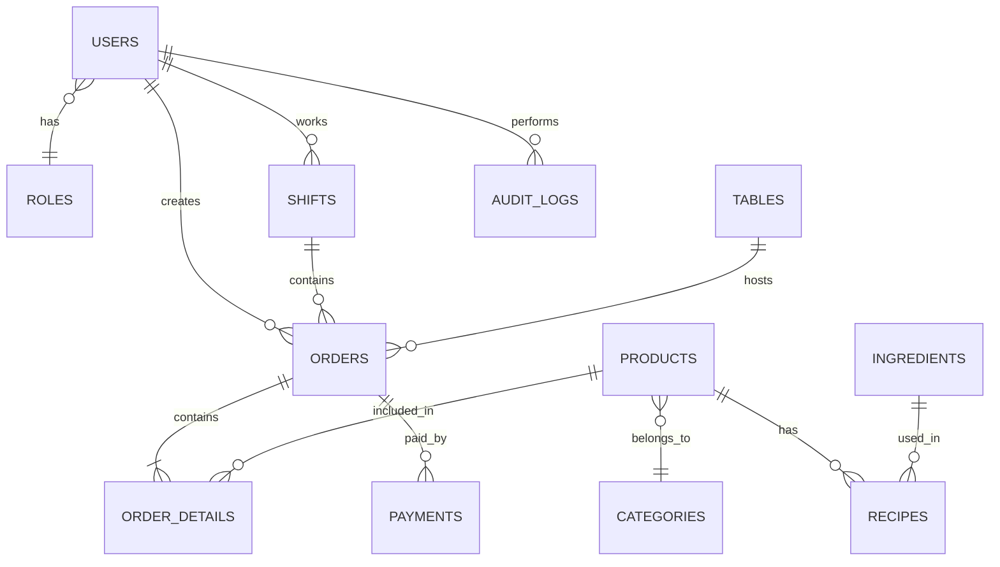

# 🗄️ Database Design Document
## RestaurantPOS - ERD & Schema

---

## 1. Entity Relationship Diagram



---

## 2. Core Tables

### 2.1 `roles`
```sql
CREATE TABLE roles (
    id INT PRIMARY KEY AUTO_INCREMENT,
    name VARCHAR(50) NOT NULL UNIQUE,
    description VARCHAR(255),
    permissions JSON
);
```

### 2.2 `users`
```sql
CREATE TABLE users (
    id INT PRIMARY KEY AUTO_INCREMENT,
    username VARCHAR(50) NOT NULL UNIQUE,
    password_hash VARCHAR(255) NOT NULL,
    full_name VARCHAR(100) NOT NULL,
    phone VARCHAR(20),
    email VARCHAR(100),
    role_id INT,
    is_active BOOLEAN DEFAULT TRUE,
    created_at DATETIME DEFAULT CURRENT_TIMESTAMP,
    FOREIGN KEY (role_id) REFERENCES roles(id)
);
```

### 2.3 `shifts` 🆕
```sql
CREATE TABLE shifts (
    id INT PRIMARY KEY AUTO_INCREMENT,
    user_id INT NOT NULL,
    start_time DATETIME DEFAULT CURRENT_TIMESTAMP,
    end_time DATETIME,
    start_cash DECIMAL(15,2) DEFAULT 0,    -- Tiền đầu ca (floating)
    end_cash DECIMAL(15,2) DEFAULT 0,      -- Tiền thực tế đếm được
    total_sales DECIMAL(15,2) DEFAULT 0,   -- Tổng doanh thu ca (hệ thống tính)
    cash_sales DECIMAL(15,2) DEFAULT 0,    -- Doanh thu tiền mặt
    variance DECIMAL(15,2) DEFAULT 0,      -- Chênh lệch (end_cash - expected)
    status ENUM('OPEN', 'CLOSED') DEFAULT 'OPEN',
    note VARCHAR(255),
    FOREIGN KEY (user_id) REFERENCES users(id)
);
```

### 2.4 `tables`
```sql
CREATE TABLE tables (
    id INT PRIMARY KEY AUTO_INCREMENT,
    name VARCHAR(20) NOT NULL UNIQUE,
    capacity INT DEFAULT 4,
    status ENUM('AVAILABLE','OCCUPIED','RESERVED','CLEANING') DEFAULT 'AVAILABLE',
    area VARCHAR(50),
    position_x INT,
    position_y INT,
    is_active BOOLEAN DEFAULT TRUE
);
```

### 2.5 `categories`
```sql
CREATE TABLE categories (
    id INT PRIMARY KEY AUTO_INCREMENT,
    name VARCHAR(100) NOT NULL UNIQUE,
    icon VARCHAR(50),
    display_order INT DEFAULT 0,
    printer_name VARCHAR(50) DEFAULT 'Kitchen_Printer', -- 🆕 Printer Routing
    is_active BOOLEAN DEFAULT TRUE
);
```
> [!NOTE]
> **Printer Routing**: Mỗi category gắn với 1 máy in (Kitchen_Printer, Bar_Printer, Cashier_Printer)

### 2.6 `products`
```sql
CREATE TABLE products (
    id INT PRIMARY KEY AUTO_INCREMENT,
    name VARCHAR(255) NOT NULL,
    description TEXT,
    category_id INT,
    price DECIMAL(15,2) NOT NULL,
    cost_price DECIMAL(15,2),
    image_path VARCHAR(255),        -- Chỉ lưu path, KHÔNG lưu BLOB
    is_available BOOLEAN DEFAULT TRUE,
    is_active BOOLEAN DEFAULT TRUE,
    created_at DATETIME DEFAULT CURRENT_TIMESTAMP,
    FOREIGN KEY (category_id) REFERENCES categories(id)
);
```

### 2.7 `orders`
```sql
CREATE TABLE orders (
    id INT PRIMARY KEY AUTO_INCREMENT,
    order_code VARCHAR(20) NOT NULL UNIQUE,
    table_id INT,
    user_id INT,
    shift_id INT,                          -- 🆕 Link to shift
    guest_count INT DEFAULT 1,             -- 🆕 Số lượng khách
    status ENUM('OPEN','COMPLETED','CANCELLED') DEFAULT 'OPEN',
    subtotal DECIMAL(15,2) DEFAULT 0,
    discount_amount DECIMAL(15,2) DEFAULT 0,
    tax_amount DECIMAL(15,2) DEFAULT 0,
    total_amount DECIMAL(15,2) DEFAULT 0,
    notes TEXT,
    cancel_reason VARCHAR(255),            -- 🆕 Lý do hủy
    created_at DATETIME DEFAULT CURRENT_TIMESTAMP,
    updated_at DATETIME ON UPDATE CURRENT_TIMESTAMP,
    FOREIGN KEY (table_id) REFERENCES tables(id),
    FOREIGN KEY (user_id) REFERENCES users(id),
    FOREIGN KEY (shift_id) REFERENCES shifts(id)
);
```

### 2.8 `order_details`
```sql
CREATE TABLE order_details (
    id INT PRIMARY KEY AUTO_INCREMENT,
    order_id INT NOT NULL,
    product_id INT NOT NULL,
    quantity INT DEFAULT 1,
    original_price DECIMAL(15,2) NOT NULL, -- 🆕 Giá gốc món
    unit_price DECIMAL(15,2) NOT NULL,     -- Giá sau khi + topping
    subtotal DECIMAL(15,2),
    modifiers JSON,                        -- 🆕 [{"name":"Size L","price":10000}]
    notes VARCHAR(255),
    status ENUM('PENDING','COOKING','READY','SERVED','CANCELLED') DEFAULT 'PENDING',
    sent_to_kitchen_at DATETIME,
    completed_at DATETIME,
    cancelled_by INT,                      -- 🆕 User đã hủy
    cancel_reason VARCHAR(255),            -- 🆕 Lý do hủy món
    FOREIGN KEY (order_id) REFERENCES orders(id),
    FOREIGN KEY (product_id) REFERENCES products(id),
    FOREIGN KEY (cancelled_by) REFERENCES users(id)
);
```

### 2.9 `ingredients`
```sql
CREATE TABLE ingredients (
    id INT PRIMARY KEY AUTO_INCREMENT,
    name VARCHAR(255) NOT NULL,
    unit VARCHAR(20) NOT NULL,             -- Base unit: g, ml, pcs
    quantity DECIMAL(15,3) DEFAULT 0,
    min_quantity DECIMAL(15,3),
    cost_per_unit DECIMAL(15,2)
);
```
> [!IMPORTANT]
> **Base Unit Convention**: Luôn lưu đơn vị nhỏ nhất (gram, ml). Code Java sẽ convert hiển thị (1000g → 1kg).

### 2.10 `recipes`
```sql
CREATE TABLE recipes (
    id INT PRIMARY KEY AUTO_INCREMENT,
    product_id INT,
    ingredient_id INT,
    quantity_used DECIMAL(15,3) NOT NULL,  -- Theo base unit của ingredient
    FOREIGN KEY (product_id) REFERENCES products(id),
    FOREIGN KEY (ingredient_id) REFERENCES ingredients(id)
);
```

### 2.11 `payments`
```sql
CREATE TABLE payments (
    id INT PRIMARY KEY AUTO_INCREMENT,
    order_id INT,
    method ENUM('CASH','TRANSFER','CARD') NOT NULL,
    amount DECIMAL(15,2) NOT NULL,
    amount_received DECIMAL(15,2),
    change_amount DECIMAL(15,2),
    transaction_code VARCHAR(50),          -- 🆕 Mã giao dịch ngân hàng
    status ENUM('PENDING','COMPLETED','REFUNDED') DEFAULT 'COMPLETED',
    user_id INT,
    created_at DATETIME DEFAULT CURRENT_TIMESTAMP,
    FOREIGN KEY (order_id) REFERENCES orders(id),
    FOREIGN KEY (user_id) REFERENCES users(id)
);
```

### 2.12 `audit_logs`
```sql
CREATE TABLE audit_logs (
    id INT PRIMARY KEY AUTO_INCREMENT,
    user_id INT,
    action VARCHAR(50) NOT NULL,
    table_name VARCHAR(50),
    record_id INT,
    old_values JSON,
    new_values JSON,
    created_at DATETIME DEFAULT CURRENT_TIMESTAMP,
    FOREIGN KEY (user_id) REFERENCES users(id)
);
```

---

## 3. Indexes
```sql
CREATE INDEX idx_orders_table ON orders(table_id);
CREATE INDEX idx_orders_status ON orders(status);
CREATE INDEX idx_orders_shift ON orders(shift_id);
CREATE INDEX idx_order_details_order ON order_details(order_id);
CREATE INDEX idx_order_details_status ON order_details(status);
CREATE INDEX idx_products_category ON products(category_id);
CREATE INDEX idx_shifts_user ON shifts(user_id);
CREATE INDEX idx_shifts_status ON shifts(status);
```

---

## 4. Sample Data
```sql
-- Roles
INSERT INTO roles (name, description) VALUES
('ADMIN', 'Quản lý toàn quyền'),
('CASHIER', 'Thu ngân'),
('WAITER', 'Phục vụ'),
('CHEF', 'Bếp');

-- Admin (password: admin123)
INSERT INTO users (username, password_hash, full_name, role_id) VALUES
('admin', '$2a$12$LQv3c1yqBWVHxkd0LHAkCe...', 'Administrator', 1);

-- Categories with Printer Routing
INSERT INTO categories (name, icon, display_order, printer_name) VALUES
('Đồ uống', '🥤', 1, 'Bar_Printer'),
('Món khai vị', '🥗', 2, 'Kitchen_Printer'),
('Món chính', '🍲', 3, 'Kitchen_Printer');

-- Tables
INSERT INTO tables (name, capacity, area) VALUES
('Bàn 1', 4, 'Tầng 1'),
('Bàn 2', 4, 'Tầng 1'),
('VIP 1', 8, 'Phòng VIP');
```

---

*Version: 1.2 | Updated: 2026-01-18*  
*Changelog: Thêm modifier_groups, modifiers, product_modifier_groups, stock_transactions, settings tables*

